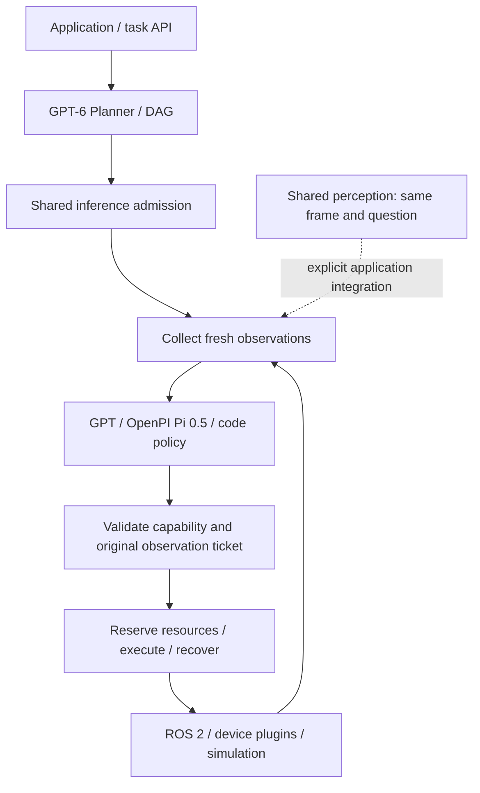
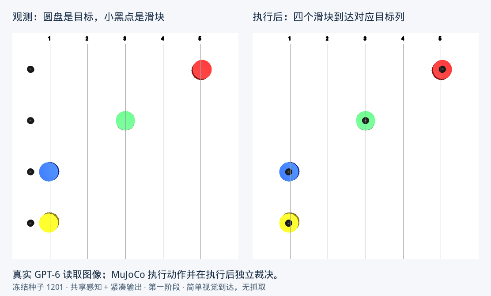

# Robot-vLLM

[简体中文](README.md) | **English**

> **🚧 Under active development — contributions welcome!**
> Features, interfaces and documentation are evolving. Share ideas, report bugs and
> discuss experiments through [Issues](https://github.com/nssmd/robot-vllm/issues),
> or submit a pull request with model integrations, robot adapters, perception and
> inference optimizations, tests or documentation. See the [contributing guide](CONTRIBUTING.md).

**A runtime connecting GPT, VLA policies and robots through shared perception, inference scheduling, action execution and recovery.**

Robot state can change while a model is thinking, and multiple robots may process
the same camera image repeatedly. Robot-vLLM manages this loop: tasks share inference
capacity, collect observations after admission, validate whether returned commands
are still applicable, and execute through ROS 2 or device plugins. Applications can
explicitly integrate a shared-perception service to reuse scene evidence.

Current integrations include a GPT-6 planner, the official OpenPI π₀.₅ client, code
policies, and ROS 2 camera/state topics, arm/gripper actions and services. The framework
supports multi-robot application development, policy integration and efficiency research.

[Quickstart](#quickstart) · [Measured results](#measured-results) · [Example tasks](#example-tasks) · [API](docs/api.md)

> **Development status:** `main` includes the shared-perception, inference-scheduling
> and experiment code below; these changes do not yet have a new release tag.
> The v0.5.0 tag includes OpenPI integration and the ROS 2 quickstart. Manipulation
> performance with real π₀.₅ weights has not been validated.

## Architecture



The dashed connection is opt-in: shared perception has been tested in the separate
experiment below and is not automatically enabled in every ROS driver.

[Architecture image, Chinese](docs/assets/architecture.png) · [SVG, Chinese](docs/assets/architecture.svg) ·
[Editable PowerPoint, Chinese](docs/assets/architecture.pptx) · [Execution semantics](docs/architecture.md)

| Component | Behavior |
| --- | --- |
| Tasks and DAGs | Validate dependencies, run independent branches, and preserve completed nodes during replanning |
| Shared inference queue | Bound concurrency and queued work across tasks per model alias; canceled HTTP calls retain capacity until their transport finishes |
| Observations and validation | Sample after admission; validate the original observation ticket and expiry for actions and terminal decisions |
| Shared perception | Merge requests for the same source, frame and question; bound the cache and support expiry and generation invalidation |
| Execution and recovery | Enforce resource exclusion, coordinate groups, confirm cancellation, persist intent and recover original ROS goal results |
| Metering | Record tokens, queue wait and model-call time; inspect capacity and cancellation through `/inference` |

Trials of the same task can opt into [GPT prefix-cache layout](docs/PROMPT_CACHE.md):
stable capabilities and task text precede current observations, with optional
provider-supported cache keys/breakpoints and reported cache read/write metering.
This does not replay actions or reduce logical input tokens. Actual cache-hit gains
remain to be verified with available endpoint quota.

Changing camera streams can opt into [bounded observation history](docs/OBSERVATION_HISTORY.md),
appending fresh frames each round. Eight GPT-5.5 replay answers were correct, but
reported cache reads were zero; this workload has no demonstrated cache speedup.

Cross-view alignment and automatic scene-change detection remain future work.
Model servers perform inference; robot controllers handle real-time control.

## Measured results

**Actual GPT-6 calls and MuJoCo dynamics: shared perception with compact output
reduced overhead on a simple visual-reaching task.**

Four independent sliders identify their colored targets' columns from one camera
image and move to those positions. Targets then change for a second phase. The
baseline permits four simultaneous model requests. All variants use the same model,
initial states and controller, with variant order rotated by seed.

| Per-episode metric | Independent | Shared | Shared + compact output |
| --- | ---: | ---: | ---: |
| Actual model calls | 8 | 2 | 2 |
| Provider-reported total tokens | 3,464 | 938 | **876 (−74.7%)** |
| Paired episode wall-time change | Baseline | −6.3% | **−30.5%** |
| Paired sensing-barrier wait change | Baseline | −7.0% | **−32.0%** |
| Paired sum of individual sensing waits | Baseline | **+14.5%** | **−9.8%** |

**Quality and accounting:** 12 frozen seeds × 3 variants produced 33 final simulator
successes, zero task failures and three infrastructure interruptions. Each variant
passed 11/11 valid episodes; interruptions are preserved and excluded from task
denominators. Shared + compact and baseline produced **identical target predictions
and recorded measured trajectories in all 11 valid pairs**. Shared-only has ten valid
baseline pairs. Tokens come from provider usage; timing percentages are medians of
per-seed paired fractional changes.

These are **preliminary results on a simple task**, not evidence of complex grasping,
cross-view collaboration or physical robot performance. Shared-only timing intervals
include no improvement, and individual waits can increase. The compact combination
performed more consistently here. Simulation advances a fixed number of steps and
is not paced to hardware wall time. See [results, intervals and limitations](docs/SHARED_SENSING_RESULTS_20260916.md).

## Example tasks

| Task | What happens | Validation scope |
| --- | --- | --- |
| Two robot policies followed by a service | Each robot makes two π₀.₅ protocol calls; a scene service runs after both finish | Default models/devices are fixtures; the official client runs for real, with optional native ROS 2 transport |
| Four-robot visual reaching | GPT-6 reads a shared overhead view; four sliders reach their targets, then reobserve changed targets | Actual model calls, MuJoCo dynamics and independent post-execution verdicts; this is the task measured above |
| Coordinator crash recovery | Two MuJoCo controllers hold after coordinator exit; restart queries original action results | Tests quarantine and prevention of duplicate execution, not manipulation success |

Example instruction: **“Move the red, green, blue and yellow sliders to the columns
containing their matching colored disks.”** The model receives only camera pixels
and public grid labels. Simulator target coordinates are used only for post-execution
adjudication. This tests shared perception, compact output and target updates; it
does not include grasping or contact manipulation.



Actual retained MuJoCo renders from frozen seed 1201, shared + compact, first phase.

## Quickstart

Requires Linux, Git and Python 3.10–3.12 (3.12 recommended). The default walkthrough
needs no GPU, model key or ROS installation:

```bash
git clone https://github.com/nssmd/robot-vllm.git
cd robot-vllm
python3 -m venv .venv
source .venv/bin/activate
python -m pip install --upgrade pip
python -m pip install -e '.[pi05]'
robot-runtime quickstart
```

The `pi05` extra installs the pinned official `openpi-client`; it does not download
model weights. Expected output:

```text
Robot-vLLM quickstart
Models: explicit fixtures; official OpenPI client is real
Transport: in-process synthetic robot drivers
  policy_robot_1: completed (policy=pi05, rounds=2)
  policy_robot_2: completed (policy=pi05, rounds=2)
  consume_scene_service: completed (policy=code, rounds=1)
Evidence: runs/quickstart/<run-id>/quickstart.json
```

The two parallel branches may print in either order. Default model responses and
robot observations are explicit fixtures exercising the complete integration.
`completed` means node execution finished, not that a grasping task succeeded.

For native ROS 2 transport, first install ROS 2 Jazzy on Ubuntu 24.04, then use its
system Python 3.12 with ROS dependencies available:

```bash
sudo apt-get install -y python3-venv ros-jazzy-control-msgs ros-jazzy-sensor-msgs ros-jazzy-std-srvs
source /opt/ros/jazzy/setup.bash
/usr/bin/python3 -m venv --system-site-packages .venv-ros
source .venv-ros/bin/activate
python -m pip install -e '.[pi05]'
ROS_DOMAIN_ID=191 ROS_AUTOMATIC_DISCOVERY_RANGE=LOCALHOST \
  robot-runtime quickstart --transport ros2
```

This starts two independent fixture controllers using actual ROS topics,
arm/gripper actions and a Trigger service. It is a same-host, multi-process demo.
The [full setup and multi-host walkthrough](docs/QUICKSTART_DEPLOYMENT.md) is currently
in Chinese; [deployment and recovery semantics](docs/deployment.md) are in English.

## Reproduce the shared-perception experiment

Requires an actual Responses API endpoint and working MuJoCo rendering. These
commands make paid model calls. The scripts are included in the development branch.

```bash
python -m pip install -e '.[simulation]'
export GP6_ENDPOINT='https://YOUR_GATEWAY/v1/responses'
export GP6_API_KEY='YOUR_KEY'
xvfb-run -a env MUJOCO_GL=glfw python scripts/sensing_benchmark.py \
  --model gpt-6-astra --concurrency 4 \
  --seeds 1201 1202 1203 1204 1205 1206 1207 1208 1209 1210 1211 1212 \
  --output runs/my-sensing-comparison
python scripts/analyze_sensing.py runs/my-sensing-comparison
```

`xvfb-run` requires system Xvfb/xauth packages. See the [experiment guide](docs/SHARED_SENSING.md).
The harness preserves configuration and source snapshots, requests/responses,
images, trajectories and final verdicts. Reusing the output directory skips completed
records. The endpoint must support the chosen model and structured output;
infrastructure failures are recorded separately.

## Connect your models and robots

- **GPT / VLM:** Configure OpenAI-compatible Responses or Chat Completions endpoints
  for planning and node policies.
- **π₀.₅:** Use the official OpenPI `WebsocketClientPolicy.infer()` integration.
  The DROID mapping explicitly declares cameras, joints, velocity scales and gripper units.
- **ROS 2:** Supported interfaces include `JointState`, `Image`,
  `FollowJointTrajectory`, `GripperCommand` and `Trigger`.
- **Device plugins:** Provide observation, argument validation and execution
  contracts. Durable recovery additionally needs native action locators and result queries.

[Pi 0.5 integration](docs/pi05.md) · [API and Python examples](docs/api.md) ·
[VLA extensions](docs/vla.md) · [Deployment](docs/deployment.md)

## What this iteration implements

1. **Inference scheduling:** A shared FIFO queue with concurrency, queue-size and
   wait limits. Canceled tasks discard late results; underlying transports retain
   capacity until they finish.
2. **Freshness checks:** Observations are collected after admission. Expired results
   cannot dispatch actions or declare a subtask complete.
3. **Shared perception:** Same-frame/same-question request merging, bounded caching,
   subscriber isolation, scene-generation invalidation and expiry.
4. **Matched evaluation:** Independent, shared and shared + compact MuJoCo variants
   using actual GPT-6 calls, provider token metering, paired timings and two waiting metrics.
5. **Interface reliability:** VLA envelope validation, explicit 502/504 provider
   errors, compatibility fixes for older FastAPI environments, and regression checks
   for cancellation, invalidation and capacity.

These changes build on the existing DAG scheduler, official OpenPI integration,
ROS 2 adapters, resource reservations and SQLite recovery. See the
[changelog](CHANGELOG.md) and [validation record](docs/validation.md).

## Documentation and checks

| Document | Contents | Language |
| --- | --- | --- |
| [Setup walkthrough](docs/QUICKSTART_DEPLOYMENT.md) | Full demo, real models, ROS 2 and Zenoh multi-host setup | Chinese |
| [Robot-serving design](docs/ROBOT_SERVING.md) | Scheduling, observation, execution and planned work | Chinese |
| [Architecture](docs/architecture.md) | Runtime boundaries and execution semantics | English |
| [Shared-perception interface](docs/SHARED_SENSING.md) | Identity, invalidation, subscribers and experiment definitions | English |
| [Measured results](docs/SHARED_SENSING_RESULTS_20260916.md) | Actual tokens, paired statistics, failures and limitations | English |
| [Literature review](docs/SENSING_RESEARCH_20260916.md) | vLLM, robot serving and collaborative perception | Chinese |
| [Deployment and recovery](docs/deployment.md) | Cancellation, persistence, quarantine and recovery | English |

```bash
python -m pip install -e '.[pi05,test]' ruff
python -m pytest -q
ruff check robot_vllm tests scripts examples
```

Local tests and native ROS transport checks are documented in the
[validation record](docs/validation.md). Automatic GitHub CI is not yet enabled;
a [template](.github/ci-tests.yml) and [activation instructions](docs/ci.md) are provided.
An unrun CI workflow is not validation evidence.

Motion planning, collision avoidance, calibration, force control and emergency stops
belong to the target robot system. Shared-object manipulation using real π₀.₅ weights
has not been validated. Runtime completion and final task success are recorded separately.

License: [Apache-2.0](LICENSE). OpenPI code, models and usage conditions are governed
by the [upstream project](https://github.com/Physical-Intelligence/openpi).
