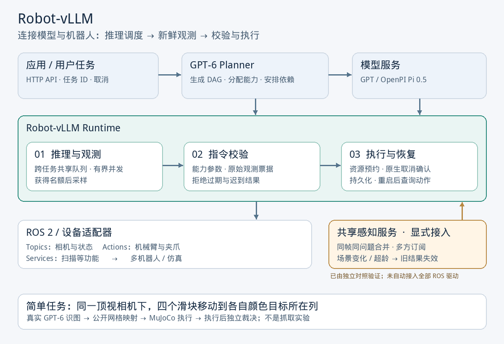

# Robot-vLLM

**简体中文** | [English](README.en.md)

> **🚧 项目正在积极开发，欢迎共同建设！**
> 功能、接口和文档会持续迭代。欢迎通过 [Issues](https://github.com/nssmd/robot-vllm/issues)
> 分享需求、报告问题与交流实验，也欢迎提交 Pull Request，贡献模型接入、机器人适配、
> 感知与推理优化、测试和文档。参与方式见[贡献指南](CONTRIBUTING.md)。

**连接 GPT、VLA 与机器人的运行时，统一管理感知、推理调度、指令执行和恢复。**

机器人会在模型推理期间继续变化，多台机器人也可能重复处理同一画面。
Robot-vLLM 管理这条链路：让任务共享推理容量，按时采集观测，校验返回指令是否仍然有效，
再通过 ROS 2 或设备插件执行。它提供显式共享感知服务，供需要复用场景信息的应用接入。

当前支持 GPT-6 Planner、官方 OpenPI π₀.₅ 客户端、代码策略，以及 ROS 2 的相机、
关节状态、机械臂/夹爪动作与服务调用。适合开发多机器人应用、接入模型策略和研究感知/执行效率。

[快速体验](#快速体验) · [实测结果](#实测结果) · [简单任务](#简单任务) · [安装与部署](docs/QUICKSTART_DEPLOYMENT.md) · [API](docs/api.md)

> **开发状态：** `main` 分支包含以下共享感知、推理调度与实验代码，尚未打新版本标签。
> v0.5.0 标签提供 OpenPI 接入与 ROS 2 快速体验。真实 π₀.₅ 权重的操作效果尚未验证。

## 架构



[矢量图 SVG](docs/assets/architecture.svg) · [可编辑 PowerPoint](docs/assets/architecture.pptx) · [详细架构与执行语义](docs/architecture.md)

| 组件 | 具体解决什么问题 |
| --- | --- |
| 任务与 DAG | 验证依赖，运行独立分支；修订任务时保留已完成节点 |
| 共享推理队列 | 每个模型别名跨任务共享并发与排队上限；取消后仍运行的 HTTP 请求继续占用容量 |
| 观测与指令校验 | 获得推理名额后采样；动作和终止决策都检查原始观测票据与有效期 |
| 共享感知服务 | 合并同源、同帧、同问题的感知请求；支持版本失效、有效期与有界缓存 |
| 设备执行与恢复 | 资源互斥、组动作、取消结果确认、持久化和原始 ROS goal ID 恢复 |
| 计量 | 记录模型 token、队列等待、调用耗时；通过 `/inference` 查询容量和取消计数 |

同一 task 的不同 trial 可以启用[GPT 前缀缓存布局](docs/PROMPT_CACHE.md)：将稳定能力与任务说明
放在当前观测之前，按端点能力设置缓存键与断点，并记录供应商返回的缓存读写 token。
这不复用旧动作，也不减少逻辑输入 token。后续诊断已确认 GPT-5.5 可复用含图前缀，
但存在偶发未命中，尚无稳定延迟收益结论。[服务端缓存排查](docs/CACHE_DIAGNOSIS.md)

变化的相机流可显式使用[有界观测历史](docs/OBSERVATION_HISTORY.md)，逐轮追加新帧。
GPT-5.5 的八次画面回放回答全部正确，但服务端缓存读取为 0，尚无该场景的缓存加速证据。

共享感知目前由应用显式接入，并在下述独立实验中验证；尚未自动应用于所有 ROS 驱动。
跨视角对齐与自动场景变化检测仍需实现。模型服务承担实际推理，机器人控制器承担实时控制。

## 实测结果

**独立缓存对照：** 固定两组调用次数与输入信息，仅改变稳定前缀布局。
GPT-5.5＋四臂 ROS 测试排除预热后，稳定前缀组 2/6 次命中，共复用 2,560 个输入
token（26.6%），对照组为 0。七轮共 56 个原生动作完成。逻辑输入 token 没有减少；
耗时还受输出长度影响，尚不能归因于缓存加速。[完整缓存对照](docs/ROS_CACHE_COMPARISON.md)

**ROS 2 四臂接入验证：** 真实 GPT-5.5 配合四个独立示例控制器，三种起始状态下，
两组共 24 个被测原生 Action 全部完成，目标一致且反馈误差小于 0.001 rad。
共享请求使模型调用 **12 → 3**、实际总 token **2,892 → 854（−70.5%）**。
供应商缓存命中为 0；收益来自同轮请求合并。“感知到动作完成”的配对中位耗时下降
10.2%，仅三轮，属于初步观察。这是 ROS 通信与控制集成测试，不是实物抓取结果。
[运行方法与详细结果](docs/ROS_SHARED_CONTROL.md)

**当前验证范围：** ROS 2 多机械臂协调控制，以及共享感知、缓存等方式对模型调用、
token 和等待时间的影响。无需固定 10×10 操作任务矩阵；下述滑块结果仍为范围有限的
历史诊断。[验证范围说明](docs/ROBOT_EVALUATION_PROTOCOL.md)

**真实 GPT-6 + MuJoCo，共享感知与紧凑输出在简单视觉到达任务上降低了开销。**

四个独立滑块从同一张相机图像识别各自颜色目标所在列，移动到对应位置；随后目标变化，再执行一轮。
基线允许四个模型请求同时运行。三组使用相同模型、相同初始状态和控制器，并轮换执行顺序。

| 每回合指标 | 独立感知 | 共享感知 | 共享感知 + 紧凑输出 |
| --- | ---: | ---: | ---: |
| 实际模型调用 | 8 | 2 | 2 |
| 实际总 token | 3,464 | 938 | **876（−74.7%）** |
| 配对任务耗时变化 | 基线 | −6.3% | **−30.5%** |
| 配对汇合前感知等待变化 | 基线 | −7.0% | **−32.0%** |
| 配对各机器人感知等待之和变化 | 基线 | **+14.5%** | **−9.8%** |

**质量与统计口径：** 12 个冻结种子 × 3 组，共 33 个最终仿真成功、0 个任务失败、
3 个基础设施中断；每组均为 11/11 个有效回合成功，中断保留且不计入分母。
共享加紧凑输出与基线的 **11 对有效样本，目标判断和记录的最终运动轨迹全部一致**。
共享组与基线有 10 对有效样本。token 来自供应商返回的 usage；耗时变化是逐种子配对降幅的中位数。

这是**初步的简单任务结果**，不代表复杂抓取、跨视角协作或实物机器人性能。
仅共享感知的耗时区间包含无改善，且个体等待可能增加；本实验中紧凑输出组合效果更稳定。
仿真按固定步数推进，未按实物时间节奏运行。详见[完整结果、区间与限制](docs/SHARED_SENSING_RESULTS_20260916.md)。

## 简单任务

| 任务 | 可以看到什么 | 验证范围 |
| --- | --- | --- |
| 两机器人策略与服务汇合 | 两台机器人各执行两轮 π₀.₅ 协议调用，完成后调用一次场景服务 | 默认模型和设备为示例；官方客户端真实运行，可切换真实 ROS 2 通信 |
| 四机器人视觉到达 | GPT-6 看共享顶视图，四个滑块移动到各自颜色目标列；目标变化后重新感知 | 真实模型调用、MuJoCo 动力学、执行后独立裁决；上表对应此任务 |
| 协调器崩溃恢复 | 两个 MuJoCo 控制器在协调器退出后保持，重启后查询原始动作结果 | 验证隔离与不重复执行；不是操作任务成功率 |

视觉到达任务示例：**“红、绿、蓝、黄四个滑块分别移动到对应颜色圆盘所在列。”**
模型只看图像与公开的网格列编号，仿真器目标坐标仅用于执行后的判定。
这项任务检验共享感知、输出压缩和目标更新，不包含抓取或接触操作。


上图来自冻结种子 1201 的共享加紧凑输出组、第一阶段；图像为实际保留的 MuJoCo 渲染结果。

## 快速体验

需要 Linux、Git、Python 3.10–3.12（推荐 3.12）。默认体验无需 GPU、模型 Key 或 ROS：

```bash
git clone https://github.com/nssmd/robot-vllm.git
cd robot-vllm
python3 -m venv .venv
source .venv/bin/activate
python -m pip install --upgrade pip
python -m pip install -e '.[pi05]'
robot-runtime quickstart
```

`[pi05]` 安装固定版本的官方 `openpi-client`，不下载模型权重。预期输出：

```text
Robot-vLLM quickstart
Models: explicit fixtures; official OpenPI client is real
Transport: in-process synthetic robot drivers
  policy_robot_1: completed (policy=pi05, rounds=2)
  policy_robot_2: completed (policy=pi05, rounds=2)
  consume_scene_service: completed (policy=code, rounds=1)
Evidence: runs/quickstart/<run-id>/quickstart.json
```

两个并行节点的打印顺序可能不同。默认模型响应和机器人观测均为明确标识的示例，
用于体验完整链路；`completed` 表示节点执行完成，不等于抓取成功。

已经安装 ROS 2 Jazzy 时，在兼容的 Python 3.12 环境中运行：

```bash
source /opt/ros/jazzy/setup.bash
ROS_DOMAIN_ID=191 ROS_AUTOMATIC_DISCOVERY_RANGE=LOCALHOST \
  robot-runtime quickstart --transport ros2
```

详见[ROS 依赖与虚拟环境安装](docs/QUICKSTART_DEPLOYMENT.md#2-用真实-ros-2-通信运行同一个体验)。
该模式启动两个独立示例控制器，实际使用 ROS Topics、机械臂/夹爪 Actions 和 Trigger Service。

## 复现共享感知实验

需要真实的 Responses API 模型端点和可用的 MuJoCo 渲染环境；以下命令会产生模型调用费用。
脚本位于当前开发版本中。

```bash
python -m pip install -e '.[simulation]'
export GP6_ENDPOINT='https://YOUR_GATEWAY/v1/responses'
export GP6_API_KEY='YOUR_KEY'
xvfb-run -a env MUJOCO_GL=glfw python scripts/sensing_benchmark.py \
  --model gpt-6-astra --concurrency 4 \
  --seeds 1201 1202 1203 1204 1205 1206 1207 1208 1209 1210 1211 1212 \
  --output runs/my-sensing-comparison
python scripts/analyze_sensing.py runs/my-sensing-comparison
```

`xvfb-run` 需要系统安装 Xvfb/xauth，具体环境见[实验说明](docs/SHARED_SENSING.md)。
实验保留配置与源码快照、模型请求和响应、图像、运动轨迹及最终裁决；使用同一输出目录
可跳过已完成记录。端点必须支持所指定的模型和结构化输出，基础设施错误单列。

## 接入自己的模型与机器人

- **GPT / VLM：** 配置 OpenAI-compatible Responses 或 Chat Completions 端点，用于规划与节点策略。
- **π₀.₅：** 通过官方 OpenPI `WebsocketClientPolicy.infer()` 接入；DROID 映射显式声明相机、关节、速度缩放与夹爪单位。
- **ROS 2：** 支持 `JointState`、`Image`、`FollowJointTrajectory`、`GripperCommand` 和 `Trigger`。
- **设备扩展：** 用插件提供观测、参数验证与执行契约；持久化恢复还需要原生动作定位与结果查询。

[真实 GPT-6 / OpenPI 配置](docs/QUICKSTART_DEPLOYMENT.md) ·
[多主机部署](docs/QUICKSTART_DEPLOYMENT.md#4-分布到多台机器) ·
[API 与 Python 示例](docs/api.md) · [VLA 扩展](docs/vla.md)

## 本版本具体做了什么

1. **推理调度：** 新增共享 FIFO 队列，限制并发、排队和等待时间；任务取消后丢弃迟到结果，后台传输结束前保留占用。
2. **时效检查：** 将观测采集放到推理名额之后；过期结果既不能发动作，也不能直接宣布子任务结束。
3. **共享感知：** 实现同帧同问题的请求合并、有界缓存、多订阅者隔离，以及场景版本变化和超龄失效。
4. **实测对照：** 新增独立/共享/共享加紧凑输出三组 MuJoCo 实验，使用真实 GPT-6 与供应商 token 计量，记录配对耗时和两种等待指标。
5. **接口可靠性：** 补齐 VLA 请求校验与 502/504 故障分类，修复旧版 FastAPI 环境中的请求体处理兼容性，增加取消、失效和容量回归检查。

以上工作基于已有 DAG、官方 OpenPI 集成、ROS 2 适配器、资源预约与 SQLite 恢复机制。
逐项记录见 [CHANGELOG](CHANGELOG.md) 与[验证文档](docs/validation.md)。

## 文档与验证

| 文档 | 内容 |
| --- | --- |
| [安装与部署](docs/QUICKSTART_DEPLOYMENT.md) | 完整体验、真实模型、ROS 2 与 Zenoh 多主机配置 |
| [框架设计](docs/ROBOT_SERVING.md) | 调度、观测、执行和演进方向 |
| [共享感知接口](docs/SHARED_SENSING.md) | 身份、失效、订阅、实验定义 |
| [实验结果](docs/SHARED_SENSING_RESULTS_20260916.md) | 实际 token、配对统计、失败与限制 |
| [文献阅读](docs/SENSING_RESEARCH_20260916.md) | vLLM、机器人服务和协作感知的对照 |
| [恢复与部署语义](docs/deployment.md) | 取消、持久化、隔离和恢复 |

```bash
python -m pip install -e '.[pi05,test]' ruff
python -m pytest -q
ruff check robot_vllm tests scripts examples
```

本地测试与真实 ROS 通信验证记录见[验证文档](docs/validation.md)。GitHub 自动 CI 尚未启用，
[模板](.github/ci-tests.yml)和[启用步骤](docs/ci.md)已提供；不以未运行的 CI 作为验证依据。

运动规划、碰撞规避、标定、力控和急停由目标机器人系统负责。真实 π₀.₅ 权重驱动的
共享物体操作尚未验证。框架执行完成与最终任务成功分别记录。

许可证：[Apache-2.0](LICENSE)。OpenPI 的代码、模型和使用条件以[官方项目](https://github.com/Physical-Intelligence/openpi)为准。
