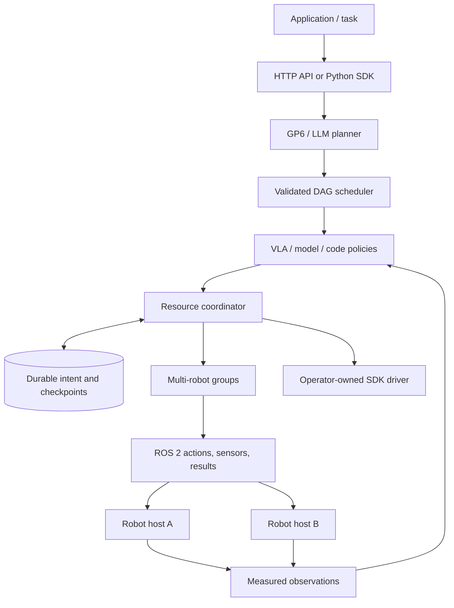

# Robot Runtime

A framework for **GP6/LLM planning, task DAGs, VLA/code policies, and coordinated
multi-robot execution over ROS 2**. A single arm is a one-device topology.

Version 0.4 adds durable execution intent, restart quarantine, native ROS result
reconciliation, task idempotency, completed-node checkpoints, bounded HTTP task
admission, and an explicit VLA joint-action bridge.

本项目将上层模型、任务 DAG、VLA/代码策略与 ROS 2 多机器人执行接在一起。
框架能力与实验结论分开记录：已验证跨机协调及故障恢复；真实 VLA、共享物体
协作与真机性能仍需要独立实验。



## Quick start

Linux, Python 3.10 or later. ROS adapters require a Python environment compatible
with the installed ROS distribution; Jazzy uses Python 3.12.

```bash
python -m pip install -e '.[serve,test]'
robot-runtime demo --arms 4
robot-runtime validate-config --config configs/system.mock.example.json
robot-runtime serve --config configs/system.mock.example.json --state-dir state
```

The demo uses explicitly synthetic devices. The service listens on loopback by
default. Set `ROBOT_RUNTIME_TOKEN` before exposing it on a non-loopback address.
The service defaults to persistent `state/`; give each deployment its own state
directory and keep it across restarts.

Submit a provided plan through `POST /tasks` with a stable `request_id`, or omit
the plan to invoke the configured GP6 planner. [API examples](docs/api.md) cover
submission, cancellation, recovery and resumption.

## Framework capabilities

| Layer | Implemented behavior |
| --- | --- |
| Planning | Configured Responses/Chat model gateways, explicit model identity checks, validated DAGs, bounded local replanning |
| Policies | Code and model/VLA nodes share one capability contract; fresh observation tickets; explicit array dimensions and units |
| Scheduling | Dependency order, parallel disjoint resources, resource reservations through inference, completed-node retention |
| Coordination | N-device groups, all-member preflight, peer cancellation, robot-side action admission, partial-execution reporting |
| ROS 2 | JointState/Image input, FollowJointTrajectory goals and feedback, terminal-result settlement, liveness monitoring |
| Durability | SQLite WAL/FULL, commit-before-dispatch, persisted native goal IDs, restart quarantine, task request deduplication and node checkpoints |
| Recovery | Query the original goal after restart/reconnection; no trajectory replay; unresolved or ambiguous state stays blocked |
| Serving | Bearer boundary, bounded request bodies and active tasks, liveness/readiness, Prometheus gauges, graceful shutdown |
| Deployment | Validated configuration, mock/ROS/SDK plugin adapters, Python and ROS container recipes, Compose and systemd examples |

See [architecture and state semantics](docs/architecture.md),
[deployment and recovery](docs/deployment.md), and [VLA integration](docs/vla.md).

## Use ROS 2

```bash
source /opt/ros/jazzy/setup.bash
python -m pip install -e '.[serve]'
robot-runtime validate-config --config configs/system.ros2.example.json
robot-runtime serve --config configs/system.ros2.example.json --state-dir state/cell-a
```

Set the model endpoint/key environment variables referenced by the configuration.
Replace example joints, limits, device endpoints, and model names with the
operator's actual deployment. Configuration validation does not connect to a
robot or submit an action. The service may start with devices offline;
`/readyz` stays unavailable until observations are ready and recovery is complete.

Models cannot install drivers, change network endpoints, infer actuator mappings,
or unlock uncertain resources. SDK plugins are installed and configured by the
operator. Enabling a lease publisher requires a matching robot-side watchdog;
ordinary ROS trajectory servers do not automatically implement one.

## Validation and experiments

The complete [CI definition](.github/ci-tests.yml) is currently an inactive
template. Automatic GitHub Actions requires workflow-write authorization; see
[activation steps](docs/ci.md). Local validation is reported separately.

```bash
python -m pytest -q
ruff check robot_vllm tests scripts examples
python scripts/http_smoke.py
```

A small actual-ROS test forces the coordinator process to exit while two MuJoCo
controllers are moving, then restarts it and reconciles the saved native goal IDs:

```bash
source /opt/ros/jazzy/setup.bash
python -m pip install -e '.[simulation]'
ROS_DOMAIN_ID=188 ROS_AUTOMATIC_DISCOVERY_RANGE=LOCALHOST \
  python scripts/ros_restart_smoke.py
```

Separate-host coordination and fault checks are available through
`python -m robot_vllm.crosshost_validation --help`. They require a dedicated lab
container and do not start training or benchmark sweeps. Every attempt preserves
source/configuration snapshots, traces, events and verdicts. Resume skips checks
already recorded as passed.

The [validation record](docs/validation.md) separates software tests, actual ROS
transport, measured MuJoCo state, actual model calls, and untested research claims.
A completed action or DAG is never a simulator task-success verdict. Historical
LIBERO episode integration remains isolated from the multi-robot task API and
never starts experiments simply by importing or serving this package.

## Scope

This release supports one authoritative coordinator with local durable state.
It is not distributed leader election or automatic active/active failover.
Group dispatch does not establish physically simultaneous motion. Motion
planning, tf2 calibration, collision avoidance, force control, shared-object
physics and hardware emergency stops belong to commissioned robot/scene
integrations; they are not established by the included coordination tests.

The VLA bridge is implemented and contract-tested. No trained VLA checkpoint or
shared-object multi-arm task success is claimed. Those experiments can be added
without changing the planning, capability and execution boundaries.

Contributions: [CONTRIBUTING.md](CONTRIBUTING.md). Deployment boundary:
[SECURITY.md](SECURITY.md). License: [Apache-2.0](LICENSE).
