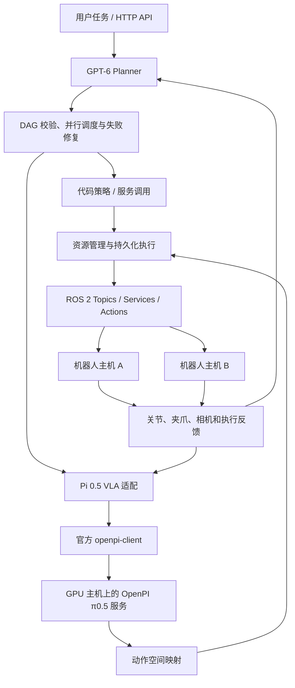

# Robot-vLLM

**GPT-6 负责 Planner 和 DAG 编排，π₀.₅（Pi 0.5）作为 VLA，ROS 2 负责机器人之间的消息、服务与动作执行。**

仓库 / Python 包名：`robot-vllm`。命令行：`robot-runtime`。

Pi 0.5 接入使用 Physical Intelligence 官方 [OpenPI](https://github.com/Physical-Intelligence/openpi) 的
[`openpi-client`](https://github.com/Physical-Intelligence/openpi/tree/main/packages/openpi-client) 第三方库。
本项目直接调用官方 `WebsocketClientPolicy.infer()`；没有另外实现一套 Pi 0.5 通信协议。

## 能体验什么

- 输入任务，由 GPT-6 生成 DAG：哪些机器人并行工作、哪些步骤需要等待、何时调用服务。
- 把相机、关节和夹爪状态送到 OpenPI 的 π₀.₅-DROID 服务，消费模型返回的动作块。
- 同一套执行器支持代码策略、GPT-6 策略和 Pi 0.5 策略；模型不直接绕过执行器控制硬件。
- 通过 ROS 2 Topics 接收状态/相机，通过 Actions 执行机械臂和夹爪动作，通过 Services 调用功能。
- 多机资源互斥、联动取消、断联隔离、重启后的原始动作结果确认，以及 DAG 已完成节点保护。



## 1. 先运行一个不需要 GPU 的完整体验

需要 Linux、Git 和 Python 3.10–3.12（推荐 3.12；官方客户端目前依赖 NumPy < 2）。这条命令会启动并收尾所有体验进程，不需要模型 Key 或 ROS。

```bash
git clone https://github.com/nssmd/robot-vllm.git
cd robot-vllm
python3 -m venv .venv
source .venv/bin/activate
python -m pip install --upgrade pip
python -m pip install -e '.[pi05]'
robot-runtime quickstart
```

`[pi05]` 安装的是官方 OpenPI 仓库中的客户端子包，固定到已核对的 commit；不会安装训练框架或下载模型权重。

预期输出：

```text
Robot-vLLM quickstart
Models: explicit fixtures; official OpenPI client is real
Transport: in-process synthetic robot drivers
  policy_robot_1: completed (policy=pi05, rounds=2)
  policy_robot_2: completed (policy=pi05, rounds=2)
  consume_scene_service: completed (policy=code, rounds=1)
Evidence: runs/quickstart/<run-id>/quickstart.json
```

这个例子做了什么：

1. GPT-6 API 的确定性示例服务返回三节点 DAG。
2. 两台示例机器人并行执行，各调用两次 VLA；这里确实使用官方 OpenPI 客户端传输 NumPy 观测和动作。
3. 收到 `(10, 8)` 的 DROID 形式动作块，按显式映射执行短前缀，然后重新观测。
4. 两个分支完成后，调用一次场景服务并消费返回值。
5. 输出每个节点的状态，并保留配置、任务图、执行事件和结果。

**这一级使用示例模型响应和合成机器人/图像，没有加载真实 GPT-6 或 π₀.₅ 权重。**
它让你先确认安装、官方客户端、DAG、VLA 适配和服务调用能一起工作。真实模型见第 3 节。

只想看四臂并行调度，也可以运行：

```bash
robot-runtime demo --arms 4
```

## 2. 用真实 ROS 2 通信运行同一个体验

下面以已安装 ROS 2 Jazzy 的 Ubuntu 24.04 为例。Jazzy 需要 Python 3.12；使用系统 Python 创建独立环境，保留 ROS 的系统依赖。

```bash
sudo apt-get install -y python3-venv ros-jazzy-control-msgs ros-jazzy-sensor-msgs ros-jazzy-std-srvs
source /opt/ros/jazzy/setup.bash
/usr/bin/python3 -m venv --system-site-packages .venv-ros
source .venv-ros/bin/activate
python -m pip install -e '.[pi05]'
ROS_DOMAIN_ID=191 ROS_AUTOMATIC_DISCOVERY_RANGE=LOCALHOST \
  robot-runtime quickstart --transport ros2
```

仍会出现三个 `completed` 节点，但通信层变为：

```text
Transport: real ROS 2 topics, actions and service; synthetic robots
```

这次启动两个独立 ROS 控制器进程，每个包含 7 关节机械臂、夹爪和两路合成相机。
它使用真实 ROS 消息传输和原生 action/service 返回值；机械臂状态是示例控制器状态，不是实物或任务物理仿真。
这是同机多进程体验。**分布到不同主机的配置见第 4 节。**

| ROS 2 机制 | 本项目如何使用 | 谁消费信息 |
| --- | --- | --- |
| Topics / pub-sub | `sensor_msgs/JointState`、`sensor_msgs/Image` 持续发布 | 适配器订阅，组成带时效的观测供 Pi 0.5 / GPT-6 使用 |
| Actions | `FollowJointTrajectory`、`GripperCommand`，包含目标、反馈、取消与终止结果 | 执行器跟踪状态；DAG 等待依赖完成 |
| Services | `std_srvs/Trigger` 请求/响应，例如扫描、设备准备等已注册功能 | 代码节点或 Planner 指定的节点调用，并读取 `success/message` |
| 应用层资源管理 | 同一组机器的占用、隔离、执行上下文和恢复 | Runtime 统一管理，避免策略争抢同一执行资源 |

ROS 2 提供通信原语；任务图、消费顺序、重试边界和跨机器人资源协调由 Runtime 实现。

## 3. 接入真实 π₀.₅ 和 GPT-6

### GPU 主机：启动官方 OpenPI π₀.₅-DROID 服务

在独立模型环境中，按 [OpenPI 官方安装说明](https://github.com/Physical-Intelligence/openpi#installation) 安装完整 OpenPI。
官方说明推理需要 NVIDIA GPU，具体显存要求以其版本和 checkpoint 为准。

```bash
git clone --recurse-submodules https://github.com/Physical-Intelligence/openpi.git
cd openpi
git checkout 215abfb217dbac7d5f1273282331b9b1866c0479
GIT_LFS_SKIP_SMUDGE=1 uv sync
GIT_LFS_SKIP_SMUDGE=1 uv pip install -e .
uv run scripts/serve_policy.py --port=8000 policy:checkpoint \
  --policy.config=pi05_droid \
  --policy.dir=gs://openpi-assets/checkpoints/pi05_droid
```

这条命令会加载真实权重。也可以把 `--policy.dir` 换成已有的本地 checkpoint。
这里明确选择 **π₀.₅-DROID**；LIBERO、ALOHA 或自训练 checkpoint 的观测与动作约定不同，不能直接混用此映射。

### Runtime 主机：先用合成机器人检查真实模型服务

```bash
export OPENPI_URI='ws://YOUR_GPU_HOST:8000'
export GP6_ENDPOINT='https://YOUR_GATEWAY/v1/responses'
export GP6_API_KEY='YOUR_KEY'
export GP6_MODEL='gpt-6-astra'  # 替换为网关实际支持的模型 ID
robot-runtime quickstart --real-models
```

此时 GPT-6 和 OpenPI 调用走你提供的真实服务；机器人与图像仍是合成体验环境。
这可以检查推理链路，但不能用来评判模型是否会抓取物体。要同时检查 ROS：

```bash
source /opt/ros/jazzy/setup.bash
ROS_DOMAIN_ID=191 ROS_AUTOMATIC_DISCOVERY_RANGE=LOCALHOST \
  robot-runtime quickstart --transport ros2 --real-models
```

`--real-models` 不会悄悄回退到示例模型。端点、认证、超时或动作约定错误会明确报错。

### 用正式配置连接机器人

先检查并修改两个文件：

- [`configs/pi05.droid.json`](configs/pi05.droid.json)：每台机器的相机名称、7 个关节顺序、关节限制、速度缩放、夹爪标定。
- [`configs/system.pi05.ros2.json`](configs/system.pi05.ros2.json)：ROS Topics/Actions/Services、机器人分组和 GPT-6/Pi 0.5 模型服务。

这些文件的默认数值面向示例控制器。接硬件时必须替换为实际控制器约定。

**π₀.₅-DROID 输出的前 7 维是关节速度输入，第 8 维是夹爪位置输入；它们不是 8 个关节角。**
适配层按显式的 `velocity_scale_rad_s × step_s` 转换短前缀到机械臂位置轨迹，夹爪独立使用米/牛顿单位。
DROID 官方示例会裁剪速度并二值化夹爪；配置里的 `clip_normalized_velocity` 明确控制裁剪。
夹爪状态切换处会截断当前前缀，执行后重新观测。该位置控制转换需要在目标控制器上验证，不能等同于原生 DROID 速度控制性能。

终端 A，启动桥接服务；它直接调用官方 `openpi-client`：

```bash
export OPENPI_URI='ws://YOUR_GPU_HOST:8000'
export PI05_BRIDGE_TOKEN='choose-a-local-bridge-token'
robot-runtime-pi05 --config configs/pi05.droid.json --port 8766
```

终端 B，设置服务地址并运行任务：

```bash
source /opt/ros/jazzy/setup.bash
export PI05_BRIDGE_ENDPOINT='http://127.0.0.1:8766/predict'
export PI05_BRIDGE_TOKEN='choose-a-local-bridge-token'
export GP6_ENDPOINT='https://YOUR_GATEWAY/v1/responses'
export GP6_API_KEY='YOUR_KEY'
robot-runtime validate-config --config configs/system.pi05.ros2.json
robot-runtime run --config configs/system.pi05.ros2.json \
  --task '让 robot_1 和 robot_2 各执行两轮 Pi 0.5 策略，然后调用 scene.trigger。'
```

这里 GPT-6 担任 Planner：生成 DAG、选已注册的能力、安排依赖；执行失败且设备状态已确认后，可以修复未完成部分。
Pi 0.5 执行具体 VLA 节点。`max_rounds` 是动作块预算，Pi 0.5 并不因此获得任务成功判定能力。

也可先用已写好的 DAG 检查 Pi 0.5 与机器人连接：

```bash
robot-runtime run --config configs/system.pi05.ros2.json \
  --plan configs/dag.pi05.example.json --task '执行已声明的两机策略流程'
```

## 4. 分布到多台机器

建议分工：协调主机运行 GPT-6 网关接入、Pi 0.5 桥接和 Runtime；GPU 主机运行 OpenPI；机器人主机各运行自己的 ROS 控制器。
只要 Topic/Action/Service 名称与配置相符，控制器可以位于不同主机。

附带显式 Zenoh 路由配置，适合不依赖跨网段 DDS 自动发现的部署。各 ROS 主机安装：

```bash
sudo apt-get install -y ros-jazzy-rmw-zenoh-cpp
```

协调主机启动路由器：

```bash
source /opt/ros/jazzy/setup.bash
export ROS_DOMAIN_ID=191
export RMW_IMPLEMENTATION=rmw_zenoh_cpp
ZENOH_ROUTER_CONFIG_URI="$PWD/configs/zenoh/router.json5" \
  ros2 run rmw_zenoh_cpp rmw_zenohd
```

机器人主机把 `configs/zenoh/robot.json5` 中的 `COORDINATOR_IP` 改为路由主机地址，然后设置：

```bash
source /opt/ros/jazzy/setup.bash
export ROS_DOMAIN_ID=191
export RMW_IMPLEMENTATION=rmw_zenoh_cpp
export ZENOH_SESSION_CONFIG_URI="$PWD/configs/zenoh/robot.json5"
```

没有硬件时，可以分别在主机 A/B 启动以下示例控制器；`--namespace` 分别用 `/robot_1`、`/robot_2`：

```bash
python -m robot_vllm.ros_validation controller \
  --namespace /robot_1 --joints 7 --with-gripper --ready runs/robot-1.ready.json
```

协调主机运行 Runtime 的终端设置 `ZENOH_SESSION_CONFIG_URI="$PWD/configs/zenoh/coordinator.json5"`，
以及同样的 `ROS_DOMAIN_ID`、`RMW_IMPLEMENTATION`，然后使用第 3 节的配置启动任务。
所有主机使用可达的可信 ROS 网络；这些心跳和路由配置不提供身份认证或物理同步保证。

已有跨主机故障验证工具：

```bash
python -m robot_vllm.crosshost_validation --help
```

它要求独立实验容器，支持切断指定 ROS 链路、检查联动取消与资源隔离；不会启动训练或大批任务评测。

## 5. 让应用调用 Runtime

服务模式默认启用 SQLite 持久化。同一状态目录只能由一个协调进程使用。

```bash
export ROBOT_RUNTIME_TOKEN='choose-an-api-token'
robot-runtime serve --config configs/system.pi05.ros2.json --state-dir state/cell-a
```

提交任务：

```bash
curl -s http://127.0.0.1:8765/tasks \
  -H "Authorization: Bearer $ROBOT_RUNTIME_TOKEN" \
  -H 'Content-Type: application/json' \
  -d '{"request_id":"application-task-001","task":"两台机器各执行两轮策略，然后调用场景服务"}'
```

返回 `task_id` 后，用 `GET /tasks/{task_id}` 查询、`POST /tasks/{task_id}/cancel` 取消。
重复使用相同 `request_id` 和内容会返回同一任务，重启后也不会重新创建。
其他入口：`/tools`、`/health`、`/readyz`、`/metrics`、`/recovery`。完整约定见 [API 文档](docs/api.md)。

## 当前验证范围

| 项目 | 状态 |
| --- | --- |
| 官方 OpenPI 客户端第三方依赖、原生 `infer()` 调用、DROID 图像/状态/动作映射 | 已实现并测试 |
| 无 ROS 快速体验、ROS 2 两机器人/夹爪/服务快速体验 | 已实际跑通，模型响应和机器人是明确标识的示例 |
| 跨真实主机的 ROS 协调、断联恢复 | 之前已在两台主机与独立 MuJoCo 模型上验证 |
| 协调器进程崩溃、持久化隔离、原始 ROS goal ID 恢复 | 已验证 |
| 真实 GPT-6 | 之前已跑通一次跨主机 DAG；其记录与示例响应分开 |
| 真实 π₀.₅ 权重驱动的实物/共享物体协作 | 尚未验证，不把客户端接入当作模型任务成绩 |

源码检查与测试：

```bash
python -m pip install -e '.[pi05,test]' ruff
python -m pytest -q
ruff check robot_vllm tests scripts examples
```

自动 GitHub CI 目前因发布凭据缺少 `workflow` 权限而未启用；[完整模板](.github/ci-tests.yml)和[启用步骤](docs/ci.md)已提供。

进一步阅读：[架构](docs/architecture.md) · [部署与恢复](docs/deployment.md) · [Pi 0.5 接入细节](docs/pi05.md) ·
[VLA 扩展](docs/vla.md) · [验证记录](docs/validation.md) · [贡献指南](CONTRIBUTING.md)。

硬件运动规划、碰撞规避、坐标标定、力控和急停由相应机器人系统负责。
框架的 DAG/action 完成不等于独立仿真或真实任务成功。
许可证：[Apache-2.0](LICENSE)。OpenPI 是独立的第三方项目，其代码、模型及使用条件以官方仓库为准。
