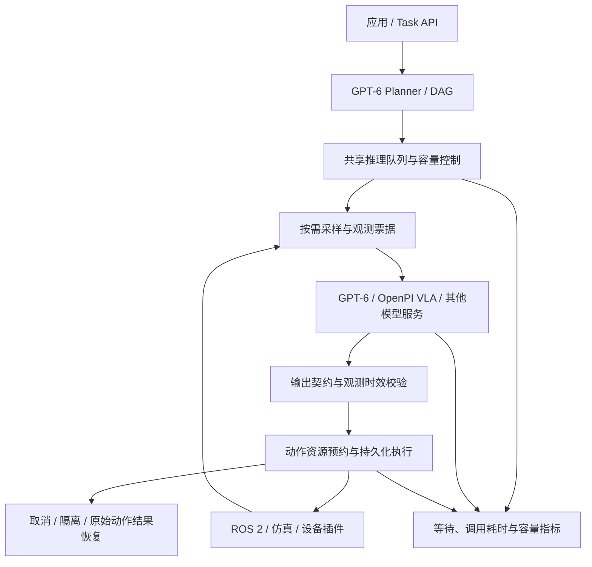

# Robot-vLLM：模型与机器人之间的运行时

Robot-vLLM 的目标是让应用提交任务，让 GPT-6、VLA 和代码策略通过同一套
观测、调度和执行接口操作机器人。框架负责管理这些请求的生命周期：什么时候
采样、什么时候推理、结果是否仍有效、能否执行，以及取消或重启后如何确认结果。

## 框架结构



模型服务与设备执行可以独立扩展。GPT-6 通过配置的 API 接入；π₀.₅ 使用官方
OpenPI 客户端；ROS 2 负责设备消息、服务和动作通信。模型输出能力参数，设备
适配器负责执行对应契约。机器人原生控制器持续负责自身的实时控制。

## 当前实现

| 层 | 已实现行为 |
| --- | --- |
| 任务 | DAG 校验、独立分支并行、依赖汇合、保留已完成节点的修订 |
| 推理 | 每个模型别名共享 FIFO 队列、并发上限、排队上限、排队超时、取消与关闭 |
| 观测 | 获得推理名额后采样；票据绑定能力、资源版本和有效期；缺失数据不补零 |
| 输出 | GPT/VLA 契约校验；执行前再次验证观测；终止且不动作的结果同样验证时效 |
| 动作 | 资源互斥、组动作、原生取消结果确认、状态不确定时保留隔离 |
| 恢复 | SQLite 持久化、原始 goal ID 查询、重启后阻止含糊重放 |
| 运维 | HTTP 鉴权、任务幂等、背压、每次调用计量、实时推理容量查询 |

推理名额先于观测采集，机器人资源在节点运行期间保持预约。这样，排队本身
不会消耗观测票据的有效期。同一模型别名的所有任务共享名额；不同机器人不能
通过创建新任务绕过该上限。多个进程或多个别名仍各自计数，共享上游服务应使用
统一别名或在服务端设置全局容量限制。

## 推理调度配置

在现有系统配置的模型项中添加：

```json
{
  "models": {
    "gp6": {
      "kind": "openai_responses",
      "model": "gpt-6-astra",
      "endpoint_env": "GP6_ENDPOINT",
      "key_env": "GP6_API_KEY",
      "timeout_s": 60,
      "inference": {
        "max_concurrency": 4,
        "max_queue": 64,
        "queue_timeout_s": 30
      }
    }
  }
}
```

`inference` 的三个默认值分别是 4、64、30 秒。`max_queue: 0` 表示忙时直接
拒绝。Planner 和节点策略使用相同别名时共享队列。FIFO 保持已排队请求的顺序，
目前不做优先级调度、跨请求拼批或自动重试。

排队满或关闭产生 `ProviderError`，排队超时产生 `ProviderTimeout`。任务记录为
基础设施问题，不生成操作成功/失败的仿真裁决。排队与采样也计入节点/任务截止
时间。`timeout_s` 约束发起后的 HTTP 操作；线程池等待与外部服务计算不是同一指标。

取消排队请求会移除它，且不会采样或调用模型。取消已发起的请求会立即停止等待
并丢弃迟到结果，但后台 HTTP 线程仍计入并发容量，直到它返回或超时。关闭服务
拒绝新的排队请求；本地取消并不证明上游模型已停止计算。关闭动作仍遵循设备侧
原生结果确认与隔离机制。

## 可观测性与效率验证

`GET /inference` 使用任务 API 的同一 Bearer 鉴权，返回每个模型别名的实时
占用、后台传输数、队列长度、峰值、调用完成/错误、过载、排队超时和取消计数。
这些是当前协调进程累计值，重启后重置，不是单个任务的结果。

任务的 `model_metrics.calls` 记录已发起调用的 `queue_time_s` 和
`wall_time_s`；`inference_queue_time_s` 汇总这些调用的排队等待。取消后的单次
`wall_time_s` 截止于调用方取消，后台传输的完整耗时计入 `/inference` 中的
`transport_time_s`。未发起调用的过载与排队取消不虚构 model call 或 token 用量。
上游未提供 token 用量时继续记为 unmetered。

运行同样的四机器人、每机器人三轮的本地对照：

```bash
python scripts/inference_benchmark.py --robots 4 --rounds 3 --latency-ms 100
```

脚本分别配置 1 和 4 个推理名额，保留各自的动作、模型调用、队列等待和总耗时。
HTTP 通信实际发生，模型响应与机器人都是 fixture。这个对照测量人为响应等待的
重叠程度；不能将其比值解释为 GPT-6 计算加速，也不能解释为机器人任务通过率。

## 下一阶段

框架的后续能力围绕可测量的瓶颈推进：

1. 观测服务：有界的最新帧缓冲、多传感器采样时间、图像预算和增量观测；在同一
   任务成功率下测量输入字节、token 和视觉编码开销。
2. 调度策略：在当前容量隔离之上加入模型服务组、任务公平性和截止时间策略；
   用并发负载测试报告排队分位数、丢弃率和有效动作吞吐。
3. VLA 执行流水线：针对具体模型与控制器验证动作块执行期间的下一轮推理、
   动作块衔接和过期前缀处理，先用仿真证明取消和时效约束。
4. 模型后端优化：将受支持的批处理、视觉特征复用、前缀缓存交给能够提供这些
   能力的模型服务，并显式声明后端支持范围。GPT-6 API 的客户端不掌握其 KV cache。
5. 任务评测：使用冻结配置、匹配任务与初始状态，比较成功率、token、队列等待、
   端到端时间和恢复次数。共享物体操作仍需独立仿真或实物裁决。

这些条目是后续工程目标；当前实现与验证见 [validation.md](validation.md)。

感知侧的文献依据、直接相关服务系统及待执行对照方案见
[多机器人感知与推理加速阅读报告（2026-09-16）](SENSING_RESEARCH_20260916.md)。
