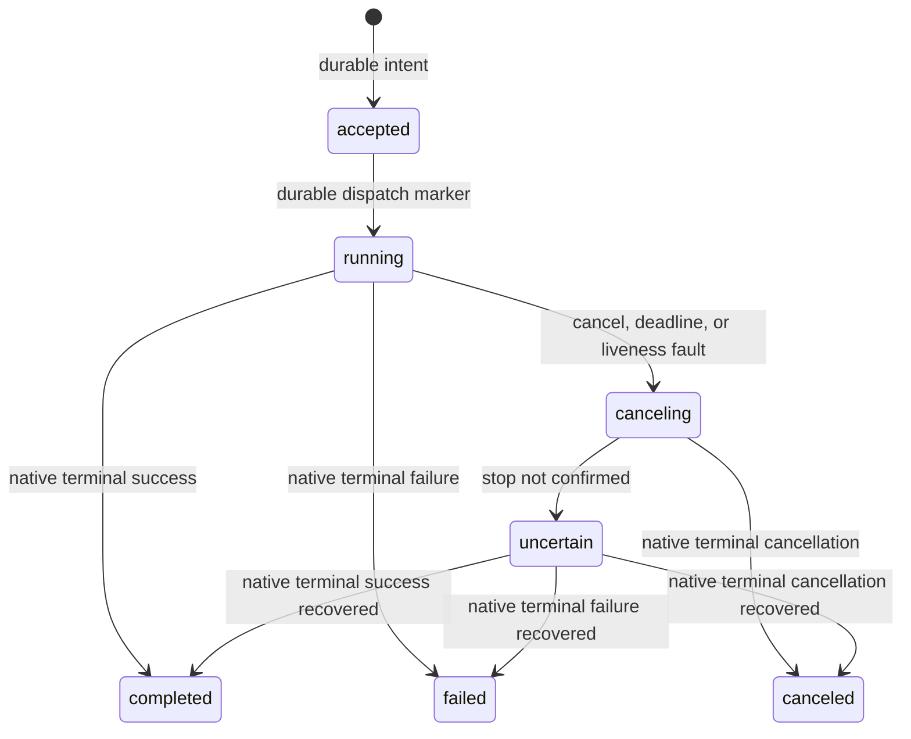

# Architecture and execution semantics

The system has five boundaries: model endpoints propose data; policies produce
capability arguments; the DAG scheduler owns task dependencies; the device runtime
owns actuator reservations; robot-side controllers own local motion. Evaluators
are separate and provide post-hoc task verdicts only.

## Task and capability contracts

`TaskPlan` validates every node and edge before dispatch. Code nodes have exact
arguments and one round; model/VLA nodes consume a new observation ticket per
round. A ticket binds capability, resource epochs, observation data and lifetime.
Missing, empty, non-finite and valid zero-valued arrays remain distinct.

A `Driver` implements `observe`, `validate`, and asynchronous `execute`. Plugins
are selected by operator configuration, never model output. Optional `reconcile`
queries a persisted native action locator. Drivers must synchronously publish a
`dispatch_locator` through the supplied feedback callback before any external
side effect, or recovery must retain uncertainty.

One runtime atomically reserves a group's resources. Robot-side admission still
checks each goal because an external controller may already own an actuator.
Partial acceptance causes cancellation of peers; it is not a distributed atomic
transaction. Group membership may span multiple machines and robots.

## Execution states

`settled=true` means the driver's termination contract has been satisfied. For
ROS this is a native terminal action result, not a generic guarantee that a real
robot is physically motionless. A cancel receipt and an elapsed timeout are not
settlement. Unknown state retains reservations.

## Durable boundaries

An optional `StateStore` uses SQLite WAL, FULL synchronous commits and a local
process lock. Service mode enables it by default; short demos remain ephemeral.
The store records request identity and accepted execution before returning an
acceptance, dispatch phase before entering the driver, native locator before ROS
SendGoal, and native settlement before releasing resources.

After process restart, prior unsettled executions quarantine their resources.
A changed capability catalog cannot rebind unresolved goals to different devices.
An accepted operation never marked dispatching can be settled as interrupted
before dispatch. Other operations require their driver's native result. ROS
reconciliation requests the saved goal UUID; it never resends a trajectory.
Controller restart or result-cache expiry may leave that UUID unknown, in which
case resources remain quarantined. There is intentionally no generic force-unlock
HTTP endpoint. Do not remove the state directory to conceal unresolved motion.

Task request IDs also survive restart. Completed node checkpoints are immutable
and committed before scheduling successors. Explicit task resumption retains
those nodes exactly. A completed physical action without a committed node result
is an ambiguous boundary: resumption rejects it with
`resume_requires_node_resolution` instead of repeating it. Operator/application
recovery must establish a new plan from current observations without replaying
that action. Native reconciliation does not invent a missing semantic checkpoint.

SQLite state supports one coordinator on a local Linux filesystem. Independent
state directories do not provide mutual exclusion across coordinators. Cross-host
leader election, fencing epochs enforced by physical controllers, and automatic
active/active failover are outside this release.

## Model and VLA boundary

GP6/LLM gateways support explicitly configured Chat Completions and Responses
endpoints. The Responses adapter accepts completed SSE envelopes; partial output
is not a plan. HTTP redirects do not forward credentials. Model identity checks
are opt-in because gateways may use deployment aliases.

The VLA bridge converts a trained policy's joint-action arrays only when the
operator supplies the joint order, limits, time step and absolute/delta semantics.
Other embodiments implement their own codec/driver; no generic normalization or
gripper convention is guessed. Policy context contains measured observations and
execution feedback, never an evaluator or hidden simulator state.

## Operational behavior

The HTTP service has bounded request bodies and active tasks, authenticated
control/recovery endpoints, readiness distinct from liveness, and Prometheus
resource gauges. Completed task records are durable; in-process caches are pruned
in durable mode. Episode journals and evidence remain append-only or immutable.

A service can start while sensors are unavailable, report non-readiness, and
recover when devices return. Shutdown requests cancellation and retains unresolved
intent. A restarted service enters recovery, rather than assuming shutdown stopped
all hardware. Configure robot-side watchdogs independently for network/process loss.
